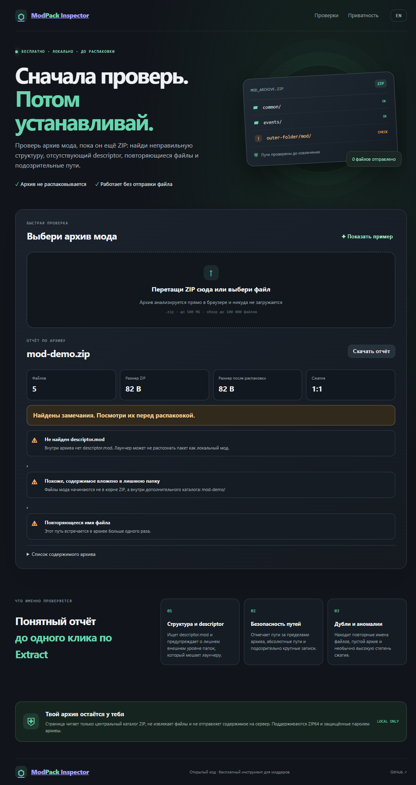

# ModPack Inspector

**A private, in-browser ZIP preflight for mod archives.** [Download the latest release](https://github.com/GhosTnever-lkm/modpack-inspector/releases/latest/download/ModPack-Inspector-0.1.0.zip). Inspect archive paths and layout before extracting a downloaded mod.

The app reads the ZIP central directory in your browser. It does not extract entries, upload the archive, or load third-party scripts or fonts. A strict Content Security Policy blocks network connections from the page.

## Use it

Use the [GitHub Pages demo](https://ghostnever-lkm.github.io/modpack-inspector/?demo), download the complete [release ZIP](https://github.com/GhosTnever-lkm/modpack-inspector/releases/latest/download/ModPack-Inspector-0.1.0.zip), or serve this folder over localhost. Browser modules may be blocked when `index.html` is opened directly with `file://`. Click **Показать пример / Show example** to see a sample report. Add `?demo` to the URL to load the example automatically.

GitHub Pages demo: https://ghostnever-lkm.github.io/modpack-inspector/?demo

## Checks

- ZIP signature and central-directory bounds.
- `descriptor.mod` presence and a common extra outer-folder layout.
- Absolute paths and `..` traversal segments that can escape the archive root.
- Duplicate names, empty archives, unusually large expanded entries, and extreme compression ratios.
- ZIP64 and encrypted entries are identified and reported.
- A local text report can be downloaded on demand.

The default review limits are a 500 MB archive, 100,000 entries, and 1 GB for any individual expanded entry.

## Limits

This is a ZIP metadata preflight, not a malware scanner, antivirus, full game validator, or guarantee that an archive is safe. It does not decompress entry contents or verify each entry's CRC. It reads metadata supplied by the archive; do not treat its report as proof that a file is trustworthy. Encrypted file contents cannot be checked without a password. ZIP64 directory listings are supported within the entry limit. Only stored and Deflate compression are common methods; unsupported methods are flagged.

The descriptor and root-layout checks target the usual local Clausewitz/Paradox mod layout. Workshop packaging and title-specific layouts vary, so a warning can be a false positive. Review the archive source and the target game's installation instructions.

## Support / Pro Version

ModPack Inspector stays free and open source. For mod authors who want a ready-to-use release workflow, the **Mod Pack Release QA Kit** is a separate paid documentation pack with a release checklist, release-notes template, bug-report form, and archive-layout manifest. It costs 50 ₽ as a one-time purchase on [Boosty](https://boosty.to/azizazimov/posts/be3aa1f6-724e-44b4-9898-4bfca8944a9a).

If this tool is useful, you can also support development on [Boosty](https://boosty.to/azizazimov). The source code and updates remain available on [GitHub](https://github.com/GhosTnever-lkm).

Public crypto addresses

Send only assets on the matching network.

| Network | Address |
|:--|:--|
| Bitcoin | `bc1qn75pj4n7gyl2k5kf2f97elvyenz52q6nn2g30u` |
| TRON | `TCBSy38X57hA6w2onJcxom24x1febc1mP1` |
| BNB Smart Chain | `0xD431a917961E0b086B96D9F72b5C8fF19b19068a` |

## Development

No build or dependency installation is required. Edit `index.html`, `styles.css`, `app.js`, or `zip-path.mjs`, then reload the page. Run path regressions with `npm test`. Serve the folder over localhost while developing. All processing is client-side.

## License

MIT. See [LICENSE](LICENSE).

## Preview

